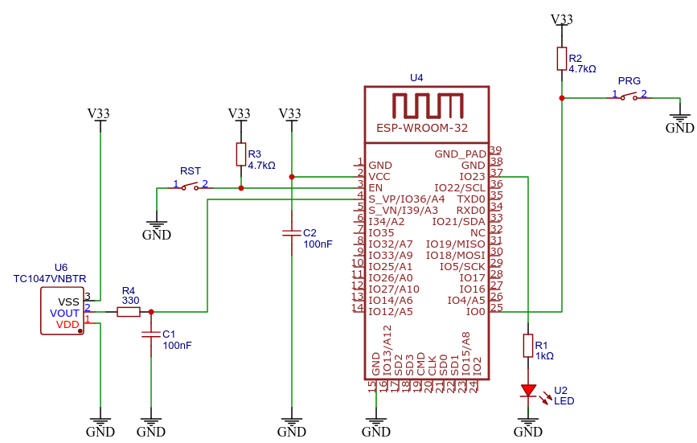

<h1>Catedra de Electrónica II</h1>
<h1>TP N°7 Comandos serie con persistencia de variables</h1>
<h2>Indice</h2>

- [Introducción](#introducción)
- [Circuito](#circuito)
- [Clonar el repositorio](#clonar-el-repositorio)
- [Licencia](#licencia)
- [Contacto](#contacto)


## Introducción
En este trabajo práctico se realizará un programa para que el ESP32 procese comandos y guarde las variables en NVS, utilizando la librería nativa del ESP32 ```Preferences```.

La estructura ```config``` almacena los valores de configuración de las variables necesarias.

```cpp
struct Config {
  float kp;
  float ki;
  float kd;
};
```

Estas variables tendrán sus valores default en ```persist.h```
```cpp
//--Variables default values
#define DEFAULT_KP      1
#define DEFAULT_KI      1
#define DEFAULT_KD      1
```

## Circuito
En la figura se aprecia el circuito de este trabajo práctico, el led conectado al pin físico 37 de la placa de desarrollo NODE-MCU32, que corresponde al puerto 23 (GPIO23) del microcontrolador, reflejará el estado de la conexión wifi.




## Clonar el repositorio
Abrir una terminal, dirigirse a la carpeta donde se encuentran los proyectos de Electrónica II y luego  correr el comando de git para clonar el repositorio.
El comando de clonación tiene la siguiente sintaxis:

```
git clone <https://github.com/nombre_de_usuario_github/repositorio> [directorio de destino]
```
Comandos para clonar este repositorio:
```
cd /home/admlca/electronicaII/platformio
git clone https://github.com/mcastellogh/UTN_EII_wifi wifi
```


## Licencia
Este proyecto está licenciado bajo GPLV3.

## Contacto
castello.marcelo@gmail.com